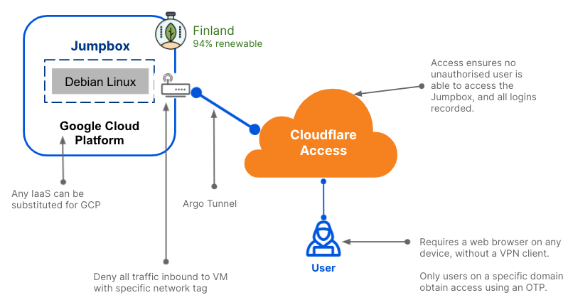

# Cloudflare Access Jumpbox

The following guide provides a breakdown on how to create a Linux (Debian) Virtual Machine (VM) hosted on Google Cloud Platform using [Terraform](https://www.terraform.io/), and remote access secured using [Cloudflare Access](https://blog.cloudflare.com/introducing-cloudflare-access/).

The VM is configured with no inbound connectivity, secured using Google's VPC firewall. The authorised user has inbound connectivity to the VM using Cloudflare Access. This allows authenticated users to access the Jumpbox without needing to remember the IP address, uploading public ssh keys, or requiring a terminal.

All access to the VM in this example is controlled via the use of a [One Time Pin](https://developers.cloudflare.com/cloudflare-one/identity/one-time-pin) that is sent to users who have an email address in a designated domain. Access can also integrate with other [SSO providers](https://developers.cloudflare.com/cloudflare-one/identity/idp-integration).

The following diagram depicts the logical overview of the setup:

## Requirements

To run the Terraform plan, you need to ensure the following have been setup prior:

- Terraform installed locally
- gCloud authentication
- Cloudflare API token and Zone setup

**Token Permissions**

ACCOUNT:

- Zero Trust: Seats:Edit
- Cloudflare Tunnel:Edit
- Cloudflare Tunnel:Read
- Access: Organizations
- Identity Providers, and Groups:Revoke
- Access: Apps and Policies:Revoke
- Access: Mutual TLS Certificates:Edit
- Access: Mutual TLS Certificates:Read
- Access: Device Posture:Edit
- Access: Device Posture:Read
- Access: Service Tokens:Edit
- Access: Service Tokens:Read
- Access: Audit Logs:Read
- Zero Trust:Report
- Zero Trust:Read
- Zero Trust:Edit
- Access: Organizations
- Identity Providers, and Groups:Edit
- Access: Organizations
- Identity Providers, and Groups:Read
- Access: Apps and Policies:Edit
- Access: Apps and Policies:Read

ZONE:

- Access: Apps and Policies:Revoke
- Access: Apps and Policies:Edit
- Access: Apps and Policies:Read
- DNS:Read, DNS:Edit

## Run Terraform

To run the plan, ensure you have edited `terraform.tfvars` with the variables pertinent to your environment. A `terraform.tfvars.example` file is provided for your convenience, and needs to be renamed to `terraform.tfvars` prior to running the plan.

In the `terraform.tfvars`, change the values `<insert_here>` specific to your requirements/setup.

1. Build and configure

`terraform apply`

2. Destroy configuration

`terraform destroy`

## Reference Links

- [Cloudflare Terraform Provider](https://registry.terraform.io/providers/cloudflare/cloudflare/latest/docs)
- [Cloudflare Terraform GitHub repository](https://github.com/cloudflare/terraform-provider-cloudflare/releases)
- [Cloudflare for Teams documentation](https://developers.cloudflare.com/cloudflare-one/)
- [Tutorial - Render an SSH client in a browser manually](https://developers.cloudflare.com/cloudflare-one/tutorials/ssh-browser)
